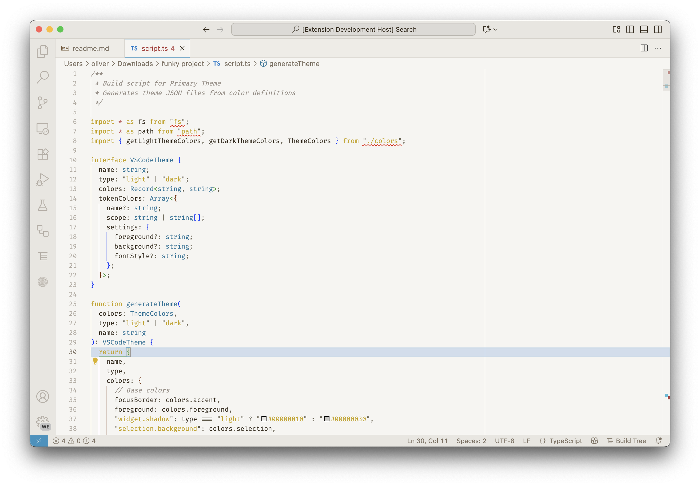

# Primary Theme for Visual Studio Code

A warm, earthy theme for Visual Studio Code inspired by the [Primary theme for Obsidian](https://github.com/primary-theme/obsidian). Features cream and warm gray backgrounds with thoughtful syntax highlighting that's easy on the eyes.

**Publisher**: [negativeone](https://marketplace.visualstudio.com/publishers/negativeone)

## Screenshots

### Light Theme


_Primary Light theme with TypeScript code_


_Primary Light theme showing the full interface_

### Dark Theme


_Primary Dark theme with TypeScript code_


_Primary Dark theme showing the full interface_

## Features

- 🎨 **Two Beautiful Variants**: Light and dark themes with consistent color philosophy
- 🌾 **Warm & Earthy**: Cream backgrounds (light) and rich warm grays (dark)
- 👁️ **Easy on the Eyes**: Carefully chosen colors for reduced eye strain
- 💻 **Comprehensive Syntax Support**: Thoughtful highlighting for all major languages
- 🔍 **Clear Highlights**: Yellow for search/word occurrences, gray for selections
- 🎯 **Semantic Colors**: Blue accents, teal for functions, amber for warnings

## Installation

### From VS Code Marketplace

1. Open **Extensions** sidebar (`Cmd+Shift+X` / `Ctrl+Shift+X`)
2. Search for `Primary Theme`
3. Click **Install**
4. Click **Set Color Theme** and select **Primary Light** or **Primary Dark**

Or press `Cmd+K Cmd+T` / `Ctrl+K Ctrl+T` and choose from the list.

### From VSIX File

1. Download the `.vsix` file from [Releases](https://github.com/OliverDudgeon/primary-vscode/releases)
2. Open VS Code
3. Go to Extensions → `...` menu → **Install from VSIX...**
4. Select the downloaded file

## Color Palette

### Light Theme

- **Background**: `#f6f5f2` (Warm cream)
- **Foreground**: `#3d3935` (Dark brown)
- **Accent**: `#4d9cbc` (Soft blue)
- **Keywords**: `#4d9cbc` (Blue)
- **Functions**: `#47959e` (Teal)
- **Strings**: `#48a473` (Green)
- **Numbers**: `#e8b840` (Golden yellow)
- **Comments**: `#9d9894` (Muted gray)

### Dark Theme

- **Background**: `#27241f` (Deep warm gray)
- **Foreground**: `#d6d2ca` (Warm beige)
- **Accent**: `#4d9cbc` (Soft blue)
- **Keywords**: `#85b1c9` (Light blue)
- **Functions**: `#63adb7` (Bright teal)
- **Strings**: `#5ebf8c` (Bright green)
- **Numbers**: `#e8c72f` (Bright yellow)
- **Comments**: `#767069` (Muted gray)

## Recommended Settings

For the best experience with Primary Theme, consider these settings:

```json
{
  "editor.fontFamily": "Cascadia Code, SF Mono, Monaco, Menlo, Consolas, monospace",
  "editor.fontSize": 14,
  "editor.lineHeight": 1.6,
  "editor.fontLigatures": true,
  "editor.cursorBlinking": "phase",
  "editor.cursorSmoothCaretAnimation": "on",
  "workbench.tree.indent": 16,
  "workbench.colorCustomizations": {
    // Optional: Make the editor truly borderless
    "[Primary Light]": {
      "sideBar.border": "#f6f5f2",
      "editorGroup.border": "#f6f5f2"
    },
    "[Primary Dark]": {
      "sideBar.border": "#27241f",
      "editorGroup.border": "#27241f"
    }
  }
}
```

## Credits

- **Original Obsidian Theme**: [Cecilia May](https://github.com/primary-theme/obsidian)
- **VS Code Port**: Oliver Dudgeon
- Inspired by the beautiful Primary theme for Obsidian

## Contributing

Found a bug or have a suggestion? Please open an issue on [GitHub](https://github.com/OliverDudgeon/primary-vscode/issues).

## License

MIT License - see [LICENSE](LICENSE) file for details.

---

**Enjoy the warm, earthy aesthetic of Primary Theme!** ☕️🌾
